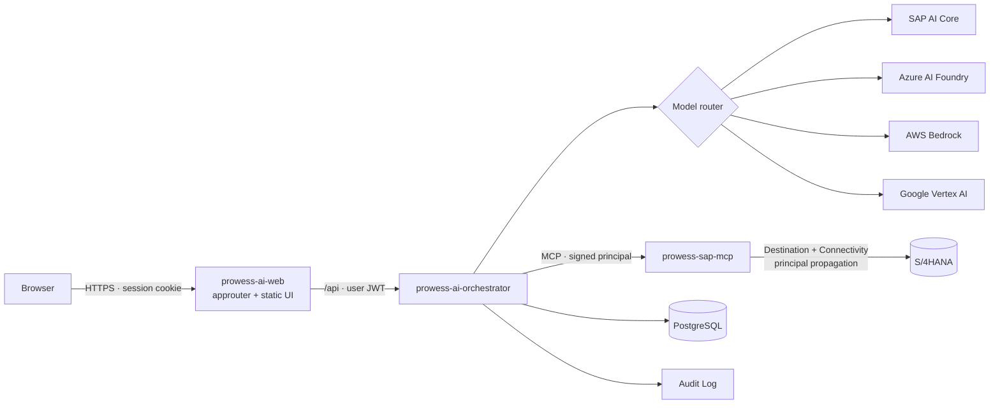

# Prowess AI — Enterprise Intelligence Workspace

A conversational workspace where AI agents work with SAP S/4HANA through MCP tools, running on SAP BTP Cloud Foundry.
Inference is provider-independent: the same agents run on **SAP AI Core** (generative AI hub), **Azure AI Foundry**,
**AWS Bedrock** or **Google Vertex AI**. Business users pick *Standard / Advanced / Private*. Administrators map
those tiers to concrete deployments.



The browser never talks to SAP, MCP servers, model providers, databases or secrets. Everything goes through the backend.

## Quick start (no credentials needed)

```sh
npm ci
npm run dev            # sap-mcp :4100 → orchestrator :4000 → web :3000
open http://localhost:3000
```

The stack starts with a **mock S/4HANA** (fictitious data, always labelled *Mock data*) and an **offline mock model**
that performs real tool calls. Try *"Why is invoice 5100012345 blocked?"*, then *Release payment block* to see
the human-confirmation flow. Switch the development identity in **Settings** to see how roles and SAP authorizations
change the outcome. For example, Jordan Lee is denied the release *by SAP*.

To use a real model, copy `.env.example` to `.env` and configure one or more providers. See
[docs/llm-providers.md](docs/llm-providers.md).

## Repository

```
apps/
  web/            Next.js + Tailwind UI (static export, served by the approuter)
  orchestrator/   Fastify API: chat/SSE, agents, model routing, MCP client, persistence, audit
  sap-mcp/        MCP server: SD / Credit / AR / AP / GL / MM / PM / Shared tools, mock + OData S/4HANA gateways
packages/
  contracts/      Shared types & zod schemas (UI components, SSE events, errors)
  llm/            Provider abstraction, adapters, resilient HTTP, model router
  security/       Signed service assertions, untrusted-content fencing, sanitizers
  observability/  Structured logging, request context, Prometheus/OTel-style metrics
infrastructure/
  approuter/      prowess-ai-web (SAP Application Router)
  btp/            xs-security.json, MTA extensions per landscape
  cloudfoundry/   manifest.yml (cf push alternative)
mta.yaml          Multi-target application descriptor
docs/             Architecture, security, deployment and operations guides
tests/e2e/        Playwright end-to-end tests
presentation/     Earlier static customer presentation (unchanged)
```

## Commands

| Command | Purpose |
| --- | --- |
| `npm run dev` | Full local stack with mocks |
| `npm test` | Unit, API, authorization, MCP contract, LLM adapter and component tests |
| `npm run test:e2e` | Playwright end-to-end tests against the local stack |
| `npm run lint` / `npm run typecheck` | Static checks |
| `npm run build:cf` | Bundles services and assembles the approuter module |
| `mbt build` | Builds the MTA archive for `cf deploy` |

## Documentation

- [Architecture](docs/architecture.md)
- [Security](docs/security.md)
- [Authentication & authorization](docs/authentication.md)
- [MCP tool layer](docs/mcp.md)
- [SAP connectivity](docs/sap-connectivity.md)
- [LLM providers](docs/llm-providers.md)
- [BTP deployment](docs/btp-deployment.md)
- [Local development](docs/local-development.md)
- [Operations](docs/operations.md)
- [Troubleshooting](docs/troubleshooting.md)

## Status

| Phase | Scope | State |
| --- | --- | --- |
| 1 Foundation | UI, chat, SSE streaming, persistence, mock model, auth abstraction | Implemented |
| 2 LLM | SAP AI Core, Azure AI Foundry, AWS Bedrock, Vertex AI adapters, router, usage | Implemented; adapters are tested against recorded wire formats, not yet against live tenants |
| 3 MCP | MCP client/server, SD/Credit/AR/AP/GL/MM/PM/Shared tools, mock backend, tool visualization | Implemented |
| 4 SAP | Destination/Connectivity, OData gateway, principal propagation | Implemented; field mappings must be validated against your S/4HANA release |
| 5 Hardening | Audit, observability, rate limits, retention, admin, CI/CD | Implemented baseline |
