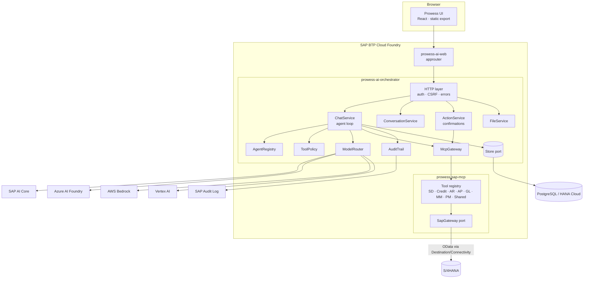
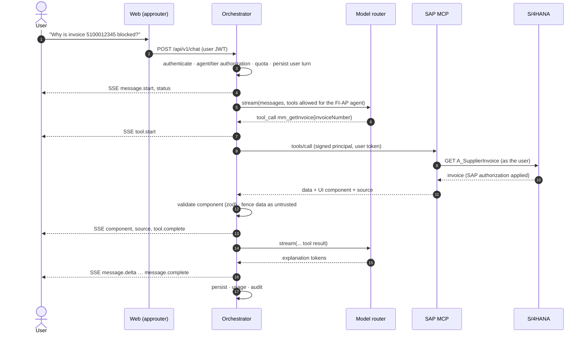

# Architecture

## Principles

Security by design · least privilege · API-first · configuration over code · provider independence ·
**SAP authorization stays authoritative** · LLM output is untrusted · explicit tool permissions ·
human confirmation for consequential actions · observable and accessible by default.

## Deployed units

| CF app | Responsibility | Scales on |
| --- | --- | --- |
| `prowess-ai-web` | SAP approuter: XSUAA login, static UI, `/api` proxy with user JWT, security headers | concurrent sessions |
| `prowess-ai-orchestrator` | API, chat orchestration, model routing, MCP client, persistence, audit, quotas | concurrent chats (I/O bound) |
| `prowess-sap-mcp` | MCP tools for SAP. One modular service for now: `MCP_DOMAINS` splits domains into separate apps later | SAP call volume |

## Independent concerns

| Concern | Where | Interface |
| --- | --- | --- |
| User experience | `apps/web` | `@prowess/contracts` (DTOs, SSE events, UI components) |
| AI orchestration | `orchestrator/src/conversations/chat-service.ts` | `ChatService.prepare/execute` |
| Model inference | `packages/llm` | `LLMProvider`, `ModelRouter` |
| MCP/tool execution | `orchestrator/src/mcp`, `apps/sap-mcp` | MCP over Streamable HTTP |
| SAP connectivity | `apps/sap-mcp/src/sap` | `SapGateway` (mock / OData) |
| Authentication | `orchestrator/src/auth` | `Authenticator` (dev / XSUAA) |
| Authorization | `AgentRegistry`, `ToolPolicy`, SAP itself | roles → agents/tiers/tools |
| Persistence | `orchestrator/src/persistence` | `Store` (memory / PostgreSQL) |
| Observability | `packages/observability` | logger, context, metrics |
| Security/audit | `packages/security`, `orchestrator/src/audit` | assertions, `AuditSink` |

Controllers (`api/routes.ts`) only parse input and call services. They contain no business logic.

## Request flow — invoice analysis

## Structured responses

The agent answer is `AgentResponse = { message, components, sources, actions, confirmations, execution }`
(`packages/contracts/src/domain.ts`). Components are **only** created from tool results and validated against
`UIComponentSchema` before they reach the browser. The UI maps each `type` to a predefined React component
(`apps/web/src/components/sap/cards.tsx`). Unknown types render nothing, and model text is never rendered as HTML.

## Context-window management

`buildContext` keeps the system prompt, a rolling **summary** of older turns, as many recent turns as fit the
tier's `maxContextTokens`, and the current turn. Turns that overflow are folded into the summary in the background
(`updateSummary`). The full history is never resent indefinitely.

## Extending

- **New agent**: add it to `apps/orchestrator/config/agents.json` (tools by name or `domain_*` wildcard, tiers, roles).
  Agents follow SAP modules (SD, Credit, FI-AR, FI-AP, FI-GL, MM, PM) plus a read-only Controls agent. When an agent is
  renamed, list its old id under `aliases` so stored conversations keep working.
- **New tool/domain**: add a module under `apps/sap-mcp/src/tools/`, register it in `registry.ts`, and extend `SapGateway`.
- **New MCP server** (HCM, Ariba, SuccessFactors…): deploy it and add it to `MCP_SERVERS`. Tool names must be unique.
- **New model provider**: implement `LLMProvider`, add it to `factory.ts` and reference it in `models.json`.
- **HANA Cloud persistence**: implement the `Store` port with `@sap/hana-client` (same queries, owner-scoped).
