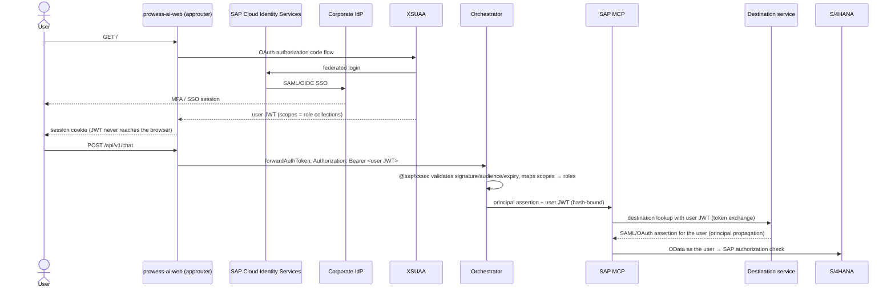

# Authentication & authorization

## Production (BTP)

- The browser holds only the approuter session cookie. Service credentials and JWTs stay server-side.
- `AUTH_MODE=xsuaa` requires a bound `xsuaa` instance. Configuration refuses `AUTH_MODE=dev` outside `PROWESS_ENV=DEV`.
- Users with no Prowess scope are rejected (`SECURITY_DENIAL: no_roles`).

## Application roles

Defined in `infrastructure/btp/xs-security.json` and assigned through role collections:

| Role collection | Scopes | Grants |
| --- | --- | --- |
| `Prowess_AI_User` | `AI_USER` | Standard and Private tiers, all agents requiring `AI_USER` |
| `Prowess_AI_PowerUser` | `AI_USER`, `AI_POWER_USER` | + Advanced tier, technical execution details (provider/model/tokens) |
| `Prowess_AI_Admin` | `AI_USER`, `AI_ADMIN` | + administration console |
| `Prowess_AI_Auditor` | `AI_AUDITOR` | audit view only (no chat) |

**These roles never grant SAP authorization.** An `AI_USER` who opens the FICO agent still sees only the invoices
their SAP user may display, and can release a payment block only if SAP authorizes them (for example
`M_RECH_WRK`, transaction MRBR). The mock backend simulates this: *Jordan Lee* is refused the release by SAP.

## Authorization layers

1. **Route**: approuter scopes on `/api` and `/admin`.
2. **Feature**: orchestrator checks the agent's `requiredRoles`, the tier's `requiredRoles`, and admin/audit roles.
3. **Tool**: the agent's `allowedTools`. Tools outside the list are never offered and are refused if requested.
4. **Action**: human confirmation plus a signed, argument-bound, single-use confirmation for every write.
5. **SAP**: S/4HANA authorization objects, evaluated for the propagated user. This is the final authority.

## Local development

`AUTH_MODE=dev` selects one of four fictitious users with the `x-prowess-dev-user` header. The UI sets it from
**Settings → Development identity**.

| User | Roles | Mock SAP authorizations |
| --- | --- | --- |
| Alex Morgan | AI_USER, AI_POWER_USER | CC 1000/2000, may release invoices |
| Jordan Lee | AI_USER | CC 1000/2000, may **not** release invoices |
| Sam Rivera | AI_USER, AI_POWER_USER, AI_ADMIN | CC 1000/2000 |
| Casey Kim | AI_AUDITOR | none |

Invoice `5100099999` belongs to company code 3000, so every user gets an SAP authorization denial for it.
