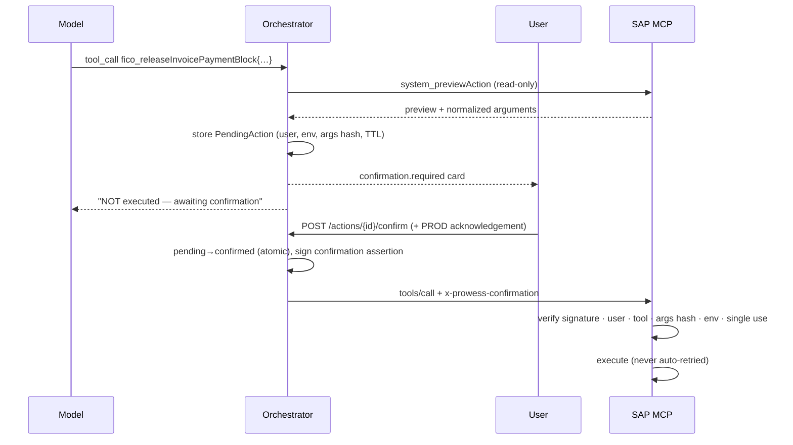

# MCP tool layer

The orchestrator is the MCP **client**. `prowess-sap-mcp` is an MCP **server** that uses the Streamable HTTP
transport in stateless mode (one short-lived server per request). The model chooses tools by intent, the orchestrator
authorizes them, and the MCP server executes them against SAP.

## Tools

| Domain | Tool | Risk | Notes |
| --- | --- | --- | --- |
| FICO | `fico_getInvoice` | READ | Header, payment block, verification issues |
| FICO | `fico_analyzeInvoice` | READ | Invoice vs PO vs goods receipts → findings and next steps |
| FICO | `fico_getPaymentStatus` | READ | Paid / open / blocked |
| FICO | `fico_getVendor` | READ | Vendor exposure (open/overdue) |
| FICO | `fico_getGLBalance` | READ | Debit/credit/balance |
| FICO | `fico_addInvoiceNote` | LOW_RISK_WRITE | Confirmation required |
| FICO | `fico_releaseInvoicePaymentBlock` | HIGH_IMPACT | Confirmation required; SAP release authorization |
| MM | `mm_getPurchaseOrder`, `mm_getPurchaseRequisition`, `mm_getGoodsReceipt`, `mm_getVendorDetails` | READ | |
| PM | `pm_getEquipment`, `pm_getNotification`, `pm_getWorkOrder`, `pm_getMaintenanceHistory` | READ | |
| Shared | `shared_getUserContext`, `shared_getSystemInformation`, `shared_searchBusinessObject` | READ | |
| System | `system_previewAction` | READ (internal) | Hidden from models; builds the confirmation card |

Every tool publishes metadata in `_meta`: `prowess/risk`, `prowess/domain`, `prowess/targetSystem`,
`prowess/operation`, `prowess/statusLabel`, plus MCP `annotations` (`readOnlyHint`, `destructiveHint`).

## Tool result contract

```jsonc
{
  "data":       { "summary": "…", "findings": ["…"], "nextSteps": ["…"] }, // → model, fenced as untrusted
  "components": [{ "type": "invoice", "data": { … } }],                    // → UI, re-validated by the orchestrator
  "source":     { "system": "S4-PRD", "objectType": "SupplierInvoice", "objectId": "5100012345/2026", "retrievedAt": "…", "mock": false },
  "followUps":  [{ "label": "Check related PO", "prompt": "…" }]          // → suggested prompts, never executions
}
```

## Write workflow



## Splitting domains into services

The domain modules are independent. To extract FICO:

1. Deploy `apps/sap-mcp` a second time as `prowess-mcp-fico` with `MCP_DOMAINS=fico` (and remove `fico` from the original).
2. Configure the orchestrator with
   `MCP_SERVERS=[{"id":"fico","url":"https://…/mcp"},{"id":"sap","url":"https://…/mcp"}]`.

No other code changes are needed. Tool names are unique across servers (duplicates are rejected at discovery).
The same pattern adds `prowess-mcp-hcm`, Ariba or SuccessFactors servers.
