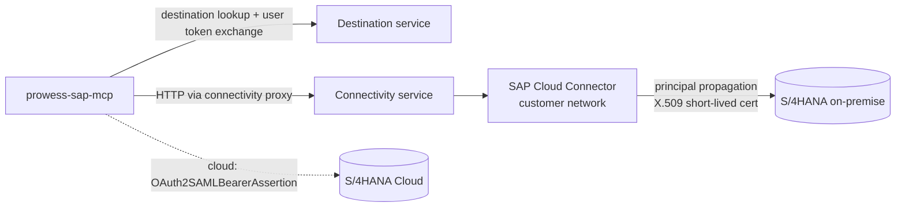

# SAP connectivity

SAP access lives **only** in `prowess-sap-mcp`, behind the `SapGateway` port:

| Mode | Class | Use |
| --- | --- | --- |
| `SAP_MODE=mock` | `MockSapGateway` | Local/CI. Fictitious data, simulated SAP authorizations. Refused in PROD. |
| `SAP_MODE=odata` | `ODataSapGateway` | S/4HANA released OData V2 APIs via BTP Destination + Connectivity |

## Topology

The SAP Cloud SDK (`@sap-cloud-sdk/http-client`) handles destination retrieval, token flows, the connectivity proxy
and CSRF tokens for writes.

## Destination `S4HANA`

On-premise (recommended):

| Property | Value |
| --- | --- |
| Type | HTTP |
| ProxyType | OnPremise |
| Authentication | PrincipalPropagation |
| URL | `http://s4h-virtual-host:44300` (Cloud Connector virtual host) |
| sap-client | your client (additional property) |

Cloud Connector: expose only the service paths below (path prefix, *not* `/`). Enable principal propagation with a
short-lived certificate mapping to SAP users. Trust the subaccount's IAS/XSUAA.

S/4HANA Cloud: `Authentication=OAuth2SAMLBearerAssertion` with a communication arrangement per API.

## APIs used (allow-list these)

| Tool(s) | Service |
| --- | --- |
| invoices, release | `API_SUPPLIERINVOICE_PROCESS_SRV` (`A_SupplierInvoice`, function `Release`) |
| vendors | `API_BUSINESS_PARTNER` (`A_Supplier`) |
| purchase orders | `API_PURCHASEORDER_PROCESS_SRV` |
| requisitions | `API_PURCHASEREQ_PROCESS_SRV` |
| goods receipts | `API_MATERIAL_DOCUMENT_SRV` |
| equipment / notifications / orders | `API_EQUIPMENT`, `API_MAINTNOTIFICATION`, `API_MAINTENANCEORDER` |

Not wired to standard APIs yet (these return a clear *not available* error): G/L balances (use a trial-balance CDS
view), free-text search (Enterprise Search), and invoice notes. Extend `ODataSapGateway` to add them.

Field mappings follow the published API definitions on the SAP Business Accelerator Hub. **Validate them against
your S/4HANA release** in DEV (fields such as status texts vary between releases).

## Identity

- User token present → the SDK exchanges it and S/4HANA executes **as the user**, so SAP authorizations apply.
- No user token → refused, unless `SAP_ALLOW_TECHNICAL_USER=true`. See the implications in [security.md](security.md).
- RFC/BAPI: expose them through an approved integration layer (for example an OData/REST wrapper in S/4 or SAP
  Integration Suite), then add a gateway method. The MCP server doesn't open RFC connections directly.

## Resilience

Each SAP call has a 20 s timeout and each tool call a 25 s timeout. Errors are mapped to safe messages
(`NOT_FOUND`, `NOT_AUTHORIZED`, `UNAVAILABLE`). Reads may be retried by the model. **Writes are never retried
automatically.** A failed write requires a new confirmation.
