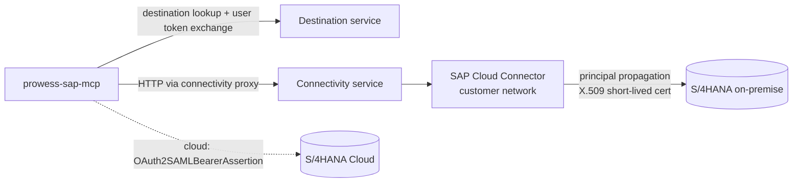

# SAP connectivity

SAP access lives **only** in `prowess-sap-mcp`, behind the `SapGateway` port:

| Mode | Class | Use |
| --- | --- | --- |
| `SAP_MODE=mock` | `MockSapGateway` | Local/CI. Fictitious data, simulated SAP authorizations. Refused in PROD. |
| `SAP_MODE=odata` | `ODataSapGateway` | S/4HANA released OData APIs (V2, and V4 for RAP services) via BTP Destination + Connectivity |

## Topology

The SAP Cloud SDK (`@sap-cloud-sdk/http-client`) handles destination retrieval, token flows, the connectivity proxy
and CSRF tokens for writes.

## Destination `S4HANA`

On-premise (recommended):

| Property | Value |
| --- | --- |
| Type | HTTP |
| ProxyType | OnPremise |
| Authentication | PrincipalPropagation |
| URL | `http://s4h-virtual-host:44300` (Cloud Connector virtual host) |
| sap-client | your client (additional property) |

Cloud Connector: expose only the service paths below (path prefix, *not* `/`). Enable principal propagation with a
short-lived certificate mapping to SAP users. Trust the subaccount's IAS/XSUAA.

S/4HANA Cloud: `Authentication=OAuth2SAMLBearerAssertion` with a communication arrangement per API.

## APIs used (allow-list these)

| Tool(s) | Service |
| --- | --- |
| invoices, release | `API_SUPPLIERINVOICE_PROCESS_SRV` (`A_SupplierInvoice`, function `Release`) |
| vendors | `API_BUSINESS_PARTNER` (`A_Supplier`) |
| purchase orders (read, create) | `API_PURCHASEORDER_PROCESS_SRV` (`A_PurchaseOrder`) |
| requisitions (read, create) | `API_PURCHASEREQ_PROCESS_SRV` (`A_PurchaseRequisitionHeader`) |
| goods receipts (read, post) | `API_MATERIAL_DOCUMENT_SRV` (`A_MaterialDocumentHeader`, goods movement code `01`, movement type `101`) |
| supplier invoice (create) | `API_SUPPLIERINVOICE_PROCESS_SRV` (`A_SupplierInvoice` with `to_SuplrInvcItemPurOrdRef`) |
| sales orders, document flow | `API_SALES_ORDER_SRV` (`A_SalesOrder`, `to_SubsequentProcFlowDoc`) |
| outbound deliveries | `API_OUTBOUND_DELIVERY_SRV;v=0002` |
| billing documents (read) | `API_BILLING_DOCUMENT_SRV` |
| billing documents (create) | OData V4 `api_billingdocument`, static action `CreateFromSDDocument` (path `/sap/opu/odata4/sap/api_billingdocument/`) |
| outbound delivery create, goods issue | `API_OUTBOUND_DELIVERY_SRV;v=0002` (`A_OutbDeliveryHeader`, function `PostGoodsIssue`) |
| customers | `API_BUSINESS_PARTNER` (`A_Customer`) |
| customer / supplier / G/L line items | `API_OPLACCTGDOCITEMCUBE_SRV` |
| accounting documents | `API_JOURNALENTRYITEMBASIC_SRV` (leading ledger `0L`) |
| credit limit and risk class | `API_CRDTMBUSINESSPARTNER` |
| payment requests (create, approve, reject, post) | Custom OData V4 service `ZAPI_FI_AGENTPAYMENT` (binding `ZAPI_FI_AGENTPAYMENT_O4`, entity `Payment`, bound actions `approve`, `reject`, `post`; path `/sap/opu/odata4/sap/zapi_fi_agentpayment_o4/`) |
| sales order create | `API_SALES_ORDER_SRV` (`A_SalesOrder`) |
| sales order simulation | `API_SALES_ORDER_SIMULATION_SRV` (`A_SalesOrderSimulation`) |
| credit memo request | `API_CREDIT_MEMO_REQUEST_SRV` (`A_CreditMemoRequest`), `API_BILLING_DOCUMENT_SRV` for the reference |
| goods receipt reversal | `API_MATERIAL_DOCUMENT_SRV` (function `Cancel`) |
| supplier invoice reversal | `API_SUPPLIERINVOICE_PROCESS_SRV` (function `Cancel`) |
| goods issue reversal | `API_OUTBOUND_DELIVERY_SRV;v=0002` (function `ReverseGoodsIssue`) |
| G/L balance, G/L activity by account | `FAC_GL_ACCOUNT_BALANCE_SRV` (`GL_ACCOUNT_BALANCESet`, ledger `0L`; period 000 is the balance carried forward) |
| G/L account search, clearing, journal entry | `FAC_GL_DOCUMENT_POST_SRV` (`FAC_POST_JOUR_ENTRY_GLACCT_VH`; `CreateClearingForOpenItem` → `ActivateItemsToBeCleared` → `Post`; `FinsPostingGLHeaders` → `FinsPostingGLItems` → `Post`) |
| receivables aging | `C_ARAGINGANALYSISOVW_CDS` (parameterized: display currency and intervals 30 / 60 / 90) |
| payables aging | `FAP_VENDOR_LINE_ITEMS_SRV` (`Items`, clearing status `2` = open) |
| supplier invoice list and approvals | `MM_SUPPLIER_INVOICE_LIST_ENH_SRV` (`C_SupplierInvoiceList`) |
| payment run proposal | `FAP_SCHEDULE_PAYMENT_PROPOSAL` (`PaymentSummarySet`, `PaymentItemSet`, `ExceptionSet`) |
| GR/IR cases | `FAC_GRIR_ANALYSIS_SRV` (`C_GRIRProcessDigest`) |
| credit-blocked sales orders | `API_SALES_ORDER_SRV` (`TotalCreditCheckStatus eq 'B'`) |
| bank reconciliation | `FAR_BS_ITM_REPROC_SRV` (`GLAccountHouseBankAccountWorklistItems`) |
| depreciation | `FAA_ASSET_MANAGE_SRV` (`C_FixedAssetMaintain`), `FAA_ASSET_VALUES_OVERVIEW_SRV` (parameterized per asset) |
| material stock | `API_MATERIAL_STOCK_SRV` |
| purchasing info records | `API_INFORECORD_PROCESS_SRV` |
| equipment / notifications / orders | `API_EQUIPMENT`, `API_MAINTNOTIFICATION`, `API_MAINTENANCEORDER` |

When SAP rejects a posting, its own message is passed on to the user (`SAP rejected …: <SAP message>`). Read errors
stay generic.

Credit exposure is not part of the released credit API: the gateway reports the sum of open receivables and flags
it as such (`exposureBasis: OPEN_RECEIVABLES`).

Not wired to standard APIs (these return a clear *not available* error): free-text search (Enterprise Search),
invoice notes, releasing a credit block and cancelling a billing document. The last two have no released API in
this landscape; they are done in SAP (credit management release, VF11). Extend `ODataSapGateway` to add them.

The finance analysis services above are Fiori application services, not released APIs. Their paths and fields were
taken from the tenant dictionary of the FI analyst agent (verified against this S/4HANA 2023 system in July and
September 2026) and must be re-verified on any other system. Writes carry `X-Requested-With: XMLHttpRequest`,
which this gateway uses for CSRF protection.

A posted payment request is a payment on account: the item stays open on the customer or supplier account and is
not cleared against invoices by the payment service. Clear it with `gl_clearOpenItems` once payment and invoice offset each other.

Field mappings follow the published API definitions on the SAP Business Accelerator Hub. **Validate them against
your S/4HANA release** in DEV (fields such as status texts vary between releases).

## Identity

- User token present → the SDK exchanges it and S/4HANA executes **as the user**, so SAP authorizations apply.
- No user token → refused, unless `SAP_ALLOW_TECHNICAL_USER=true`. See the implications in [security.md](security.md).
- RFC/BAPI: expose them through an approved integration layer (for example an OData/REST wrapper in S/4 or SAP
  Integration Suite), then add a gateway method. The MCP server doesn't open RFC connections directly.

## Resilience

Each SAP call has a 20 s timeout and each tool call a 25 s timeout. Errors are mapped to safe messages
(`NOT_FOUND`, `NOT_AUTHORIZED`, `UNAVAILABLE`). Reads may be retried by the model. **Writes are never retried
automatically.** A failed write requires a new confirmation.
