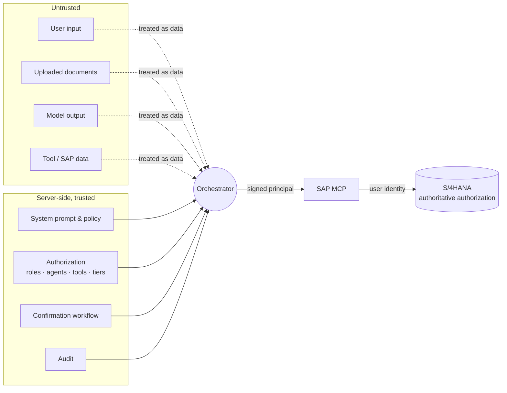

# Security

## Trust boundaries

## Controls

| Threat | Control | Where |
| --- | --- | --- |
| Broken access control / IDOR | Every conversation, attachment and action query includes `user_id` + `tenant_id`. IDs are 128-bit random. Cross-user access returns 404. | `persistence/*`, tests `conversation privacy` |
| Privilege via AI roles | Prowess roles gate features only. SAP evaluates its own authorization on every call. The UI says so explicitly. | `mock-gateway.ts` simulates SAP denials; `Header.tsx` |
| MCP as authorization bypass | MCP rejects calls without an HMAC-signed, 2-minute principal assertion (audience-bound). The forwarded user token is hash-bound to the assertion. | `packages/security/assertion.ts`, `sap-mcp/src/server.ts` |
| Unauthorized/silent writes | Every non-READ tool needs a **confirmation assertion** bound to action ID, user, tool, **SHA-256 of the exact arguments** and environment. Each one is single-use (replay cache) and signed only by `ActionService.confirm` after the human clicks Confirm. Write tools use strict schemas. | `server.ts#checkConfirmation`, `action-service.ts` |
| Production mistakes | Pending actions are bound to the environment they were prepared in. PROD requires an explicit acknowledgement checkbox and `acknowledgeEnvironment=PROD`. PROD shows a red frame and badges. | `ConfirmationCard.tsx`, `action-service.ts` |
| Excessive tool permissions | Agents list allowed tools explicitly. Tools not offered to the model are refused and audited (`SECURITY_DENIAL`). `TOOL_RISK_OVERRIDES` can raise but never lower a risk. Unknown risk metadata is treated as `HIGH_IMPACT`. | `agents/registry.ts`, `security/tool-policy.ts` |
| Prompt injection / indirect injection | The system prompt is server-built and immutable. Tool results and documents are wrapped in `<untrusted>` fences, with delimiter look-alikes neutralized. Injection markers are logged. Tools are chosen by the model **and then** authorized by server policy, and writes still need a human. | `llm/context.ts`, `packages/security/content.ts` |
| Tool injection / fabricated data | Components come only from tool results and are validated by zod schemas. Invalid components are dropped. The model can't create UI. | `chat-service.ts`, `contracts/components.ts` |
| XSS / malicious Markdown | Raw HTML is skipped. Only http(s)/mailto links survive (`noopener noreferrer`). **Images are never loaded** (exfiltration channel). ESLint forbids `dangerouslySetInnerHTML`. The CSP pins inline script hashes. | `Markdown.tsx`, `scripts/package-web.mjs`, `xs-app.json` |
| CSRF | Mutating API calls need `X-Requested-With: prowess`, which a cross-site request can't set without a CORS preflight, and none is granted. Optional Origin allow-list. The approuter session cookie is SameSite. | `app.ts` |
| SSRF | No user-controlled outbound URLs. Provider, MCP and SAP endpoints come from configuration and bindings only. OData keys are quote-escaped literals. | `odata-gateway.ts` |
| Injection (SQL) | Parameterized statements only. | `postgres.ts` |
| Insecure upload | Extension allow-list, **magic-byte validation** (MIME from the browser is ignored), size limit, filename sanitization, ClamAV INSTREAM scanning (fail-closed; required outside DEV), private 0600 storage, TTL purge, decompression-bomb limit. Files are never served back. | `files/*` |
| Insecure deserialization | JSON only, schema-validated at every boundary (zod). | routes, MCP |
| Secret leakage | No secrets in Git (`.env.example` placeholders only, gitleaks in CI). Logger redacts secret-like keys and omits prompt/content fields. Admin UI never shows credentials. | `observability/logger.ts` |
| DoS / cost abuse | Per-user token bucket, concurrent-stream bulkhead, per-user and per-agent daily token quotas, tier-level max output/context, tool-round cap, body limits. | `usage/limits.ts` |
| Dependency vulnerabilities | `npm audit` (runtime, high+) and CodeQL in CI. | `.github/workflows/ci-cd.yml` |

## Service-to-service secret

`SERVICE_ASSERTION_SECRET` (≥ 32 chars) is shared only between the orchestrator and the MCP services. Put it in the
`prowess-secrets` user-provided service. Rotate it by redeploying both apps with the new value; assertions live only
seconds. For multi-team MCP estates, replace HMAC with XSUAA token exchange (the `Authenticator` port already
validates XSUAA tokens).

## Technical-user scenarios

`SAP_ALLOW_TECHNICAL_USER=false` by default. The OData gateway refuses to call SAP without an end-user token. If you
enable it, calls run as the destination's technical user and **SAP can no longer tell users apart**. You must then:
restrict the technical user's SAP roles to read-only display objects, rely on Prowess agent/tool allow-lists, and
review the Prowess audit trail. That trail still records the real end user for every call. Never enable it for write tools.

## Audit events

`USER_LOGIN` (recorded when a user opens the workspace; IdP sign-in events stay in SAP Cloud Identity Services), `CONVERSATION_CREATED`, `CONVERSATION_DELETED`, `AGENT_INVOKED`, `MCP_TOOL_INVOKED`,
`SAP_READ`, `SAP_WRITE_REQUESTED`, `SAP_WRITE_CONFIRMED`, `SAP_WRITE_CANCELLED`, `SAP_WRITE_COMPLETED`,
`SAP_WRITE_FAILED`, `MODEL_PROVIDER_USED`, `FILE_UPLOADED`, `SECURITY_DENIAL`, `ADMIN_ACCESS`.

Each event carries a correlation ID, timestamp, user, tenant, agent, tool, target system, operation, status and
duration. **No tokens, prompts, model output or business payloads.** A test asserts that invoice amounts and vendor
names don't appear in audit records.
