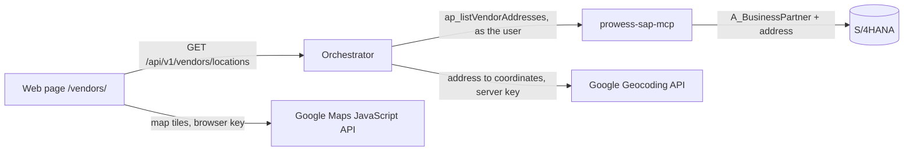

# Vendor map

The page `/vendors/` shows the suppliers of the connected SAP system on a Google map.

## Flow

SAP is read as the signed-in user, so SAP authorizations decide which suppliers appear. The tool
`ap_listVendorAddresses` is internal: models never see it, because its result is the whole vendor master.

## Which vendors are shown

SAP holds no coordinates, so each address is geocoded. A vendor is left off the map when

- it has neither a city nor a postal code, or
- Google cannot resolve its address to anything more precise than the country.

The response reports how many were left out (`excluded`). Each placed vendor carries a precision:

| Precision | Meaning |
| --- | --- |
| `street` | Google found the street or building |
| `city` | Placed at the city named in SAP |
| `approximate` | Placed by postal code alone, or only at state level |

The search uses street and city. The postal code is used only when there is no city, and the region is not
used at all: both are unreliable in the vendor master.

Vendors that share an address share a pin; the pin shows how many, and selecting it lists them.

## Configuration

| Setting | Used by | Notes |
| --- | --- | --- |
| `MAPS_API` | browser | Maps JavaScript API key. Restrict it to the web app's addresses. It is sent to the page by design. |
| `MAPS_MAP_ID` | browser | Map ID (vector, JavaScript). Not a secret. |
| `GEO_API` | orchestrator | Geocoding API key. Never sent to the browser. |
| `GEOCODE_CACHE_FILE` | orchestrator | Optional. Default `.cache/geocode.json`. |

Set them as environment variables locally (`.env`) or as entries of the `prowess-secrets` service on BTP.
Without `GEO_API` the endpoint answers `MAP_NOT_CONFIGURED`; without `MAPS_API` or `MAPS_MAP_ID` the page
shows the vendor list without a map.

Coordinates are cached for 30 days, the limit in Google's terms, and unresolved addresses are retried after a
day. On Cloud Foundry the cache file is lost on restart, so the first map load after a restart geocodes again.

The content security policy of the approuter (`infrastructure/approuter/xs-app.json`) and of the Cloudflare
BFF (`apps/edge/src/bff.ts`) allows the Google Maps domains.
