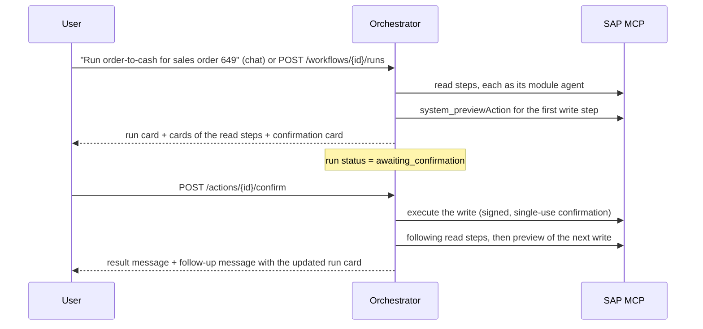

# Workflow runs

A workflow is a configured multi-step SAP process, for example order-to-cash. A **run** is one execution of it: a
persisted plan whose steps are owned by module agents. Read steps execute as soon as they are reached. A write step
never executes on its own: it becomes a pending action, the run pauses, and it resumes when a person confirms.

## Definition

Workflows live in `apps/orchestrator/config/workflows.json` and are validated at startup.

```jsonc
{
  "id": "order-to-cash",
  "agents": ["sd"],                               // agents whose chats may start it
  "subject": "sales order ${input.salesOrder}",   // shown in the run title
  "input": [{ "name": "salesOrder", "label": "Sales order", "pattern": "^\\d{1,10}$" }],
  "steps": [
    { "id": "order", "agent": "sd", "tool": "sd_getSalesOrderFlow", "arguments": { "salesOrder": "${input.salesOrder}" } },
    { "id": "credit", "agent": "credit", "tool": "credit_getCreditExposure", "arguments": { "customer": "${steps.order.soldTo}" },
      "haltWhen": [{ "value": "${steps.order.creditStatus}", "equals": "BLOCKED", "reason": "…" }] },
    { "id": "delivery", "agent": "sd", "tool": "sd_createDelivery", "arguments": { "salesOrder": "${input.salesOrder}" },
      "skipWhen": [{ "value": "${steps.order.hasDelivery}", "equals": "true" }] }
  ]
}
```

- `${input.<name>}` is a validated run input. `${steps.<stepId>.<output>}` is a value an earlier step's tool published
  in its `outputs` (document numbers, statuses). A step whose reference cannot be resolved fails the run.
- `skipWhen` makes a run safe to repeat: a posting that is already done in SAP is skipped, not posted twice.
- `haltWhen` stops the run as **blocked** after the step, with the given reason (for example a credit block).

## Delivered workflows

| Workflow | Started by | Steps (owning agent) |
| --- | --- | --- |
| `order-to-cash` | SD agent | check order (SD) → credit exposure (Credit) → delivery (SD) → goods issue (SD) → billing (SD) → verify flow (SD) → customer account (FI-AR) |
| `purchase-to-pay` | MM agent | check order (MM) → goods receipt (MM) → supplier invoice (MM) → verify flow (MM) → supplier account (FI-AP) |

Purchase-to-pay takes the purchase order, the company code, the supplier's invoice number and its gross amount. The
goods receipt covers the quantity still open; the invoice covers the quantity received, at the order price. If
invoice verification blocks the invoice for payment (price or quantity variance), the run ends as **blocked** and the
block is released separately with `mm_releaseInvoicePaymentBlock`. Payment itself is not part of the workflow.

## How a run executes



- **Each step runs as its module agent.** The agent's tool allow-list and required roles apply, the user must be
  entitled to every agent that owns a step, and SAP authorizes every call as the user.
- **Every write keeps the existing safeguards**: preview, pending action, argument hash, single-use confirmation,
  production acknowledgement. A workflow adds no way to post without a person.
- **Cancelling or letting a confirmation expire** ends the run as cancelled. A failed SAP posting ends it as failed.
  Nothing is retried automatically.
- **Statuses**: `running`, `awaiting_confirmation`, `completed`, `blocked`, `failed`, `cancelled`.
- **Audit**: `WORKFLOW_STARTED` and `WORKFLOW_ENDED`, and the run id on every `SAP_WRITE_REQUESTED` and `SAP_READ` of the run.

## API

| Method | Path | Purpose |
| --- | --- | --- |
| GET | `/api/v1/workflows` | Workflows the user may run, with the agent of each step |
| POST | `/api/v1/workflows/{id}/runs` | Start a run in a conversation of its own. Body: `{ "input": { … } }` |
| GET | `/api/v1/runs/{id}` | Current state of a run (owner only) |
| POST | `/api/v1/actions/{id}/confirm` · `/cancel` | Unchanged; the response now also carries `followUp` messages of the run |

In chat, agents listed under a workflow's `agents` are offered the orchestrator-native tool `workflow_start`.

## Persistence

Runs are stored through the `Store` port (`runs`), in memory for development and in the `workflow_runs` table in
PostgreSQL (migration 2). Runs are owner-scoped like conversations.

## Limits

- Runs start from a chat turn or an API call. There is no scheduler yet.
- A run's confirmation can only be given by the user who started it. Approval by a second person is not built yet.
- Against real S/4HANA, the order-to-cash postings (`sd_createBillingDocument` through the OData V4 action
  `CreateFromSDDocument`) and the purchase-to-pay postings are mapped but have not yet been run against the system.
- The demo gateway checks an invoice against the goods received with a fixed 12 % tax rate and a 2 % tolerance. In
  S/4HANA the tax code and the tolerance keys of the company code decide.
